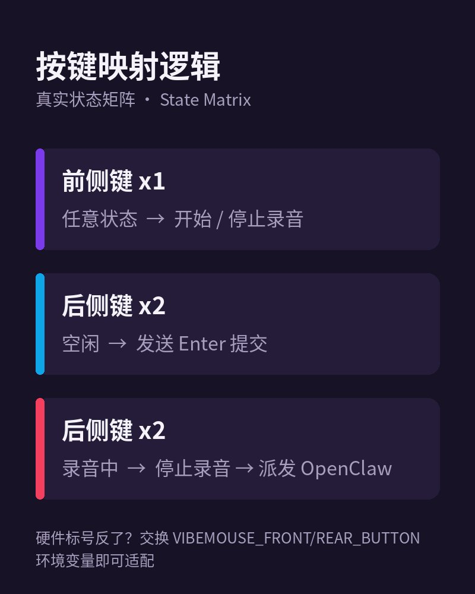

写代码的时候想给 AI 发一段长提示词，打字打到手酸？

VibeMouse 把整条语音输入流绑在了鼠标侧键上 🖱️

**按键逻辑（真实状态矩阵）：**

- 前侧键（x1）：开始 / 停止录音
- 后侧键（x2）空闲时：发送 Enter 直接提交
- 后侧键（x2）录音中：停止录音，把转写文本派发给 OpenClaw



**技术栈是真的硬核：**

- 语音识别用 SenseVoice，默认走 ONNX 后端，部署体积小
- 可选 PyTorch 后端（GPU 兜底）：`pip install -e ".[pt]"`
- 还有 Intel NPU 可选依赖：`pip install -e ".[npu]"`
- 鼠标事件监听优先走 `evdev`，留了 fallback 路径

**设计上最在意的三件事：**

低摩擦、日常稳定、以及任何子系统挂掉时都能优雅降级——OpenClaw 派发失败会自动回退到剪贴板，不会把你的话吞掉。

第一个 commit 就是 2026-03-01 的
`feat: add mouse side-button voice dictation app with SenseVoice backends`，
从那天起这就是一个能天天用的工具，不是玩具。

源码 Apache-2.0 开源，欢迎来试试 👇

```bash
pip install -e .
export VIBEMOUSE_BACKEND=funasr_onnx
vibemouse
```
